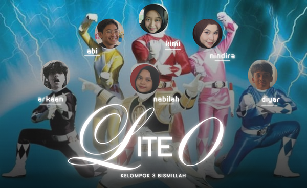

<p align="center">
  
</p>

## Struktur Proyek dan PIC

- `src/`
  - `main.c` — Abi
  - `arsip.c` — Nabilah
  - `animasi.c` — Arkaan
  - `skor.c` — Kimi
  - `sorting.c` — Diyar
  - `visual.c` — Nindira
  - `struktur.h` — Nabilah
- `data/` — berisi file `thadiah.txt` dan `tgerak.txt` untuk input/output game

## Cara Build

Gunakan compiler C seperti `gcc`.

```powershell
git clone https://github.com/nabilah-nugroho/uas-algoritma-kelompok3.git
```

```powershell
cd uas-algoritma-kelompok3
```

```powershell
code .
```

```powershell
gcc src/animasi.c src/arsip.c src/main.c src/skor.c src/sorting.c src/struktur.h src/visual.c -o LiteO
```

```powershell
./LiteO
```
